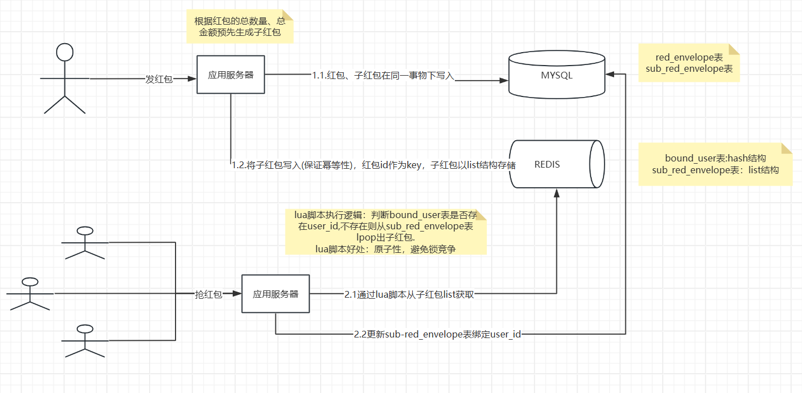

###  技术选型方案
     抢红包需求实现的技术难点在于高并发的环境下确保计算准确，传统数据库实现必须要加行级锁，导致性能急剧下降，达不到业务需求
     通过利用redis lua脚本的原子性避免了传统数据库实现锁竞争的问题。redis命令的单线程执行，以及lua脚本事务性特点，避开了锁竞争的问题。
     但由于数据的最终状态要落到数据库持久化，不可避免的出现了同一份数据在redis和数据库一致性的分布式事务问题，对于分布式事务的问题采用比较普遍的SAGA
     解决方案就可以。SAGA解决方案的主要特点是保证针对每一个数据源的操作的事务性、幂等性的前提下，在中间环节出现失败，通过补偿机制重试达到数据的最终一致性。

###  技术架构设计

###  部署环境列表
    mysql version:8.0.40
    redis version:3.0.504
    jdk   version:1.8.0_112

###  配置文件
redis:
  url: redis://localhost:6379
spring:
  application:
    name: RedEnvelope

  datasource:
    url: jdbc:mysql://localhost:3306/hb?useSSL=false&serverTimezone=UTC
    username: root
    password:
    driver-class-name: com.mysql.cj.jdbc.Driver

###  部署步骤
    1.安装mysq,初始化db.sql
    2.安装redis
    3.修改application.yml
    4.启动应用

###  接口列表

    生成红包接口(测试使用):http://localhost:8080/api/generate
    返回值:{"TOTAL_COUNT":100,"TOTAL_AMOUNT":500,"id":3,"bindUserIds":null,"total_AMOUNT":500,"total_COUNT":100}

    抢红包家口:http://localhost:8080/api/get?hbid=4&uid=62
    返回值:{"parentId":3,"id":1,"amount":5,"userId":62}

###  db.sql

CREATE TABLE `red_envelope`
(
    `id` INT(10) NOT NULL,
    PRIMARY KEY (`id`) USING BTREE
) COLLATE='utf8mb4_0900_ai_ci'
ENGINE=InnoDB
;

CREATE TABLE `sub_red_envelope`
(
    `id`        INT(10) NOT NULL,
    `parent_id` INT(10) NOT NULL,
    `user_id`   INT(10) NOT NULL DEFAULT '0',
    `amount`    INT(10) NOT NULL,
    PRIMARY KEY (`id`, `parent_id`) USING BTREE
) COLLATE='utf8mb4_0900_ai_ci'
ENGINE=InnoDB
;

