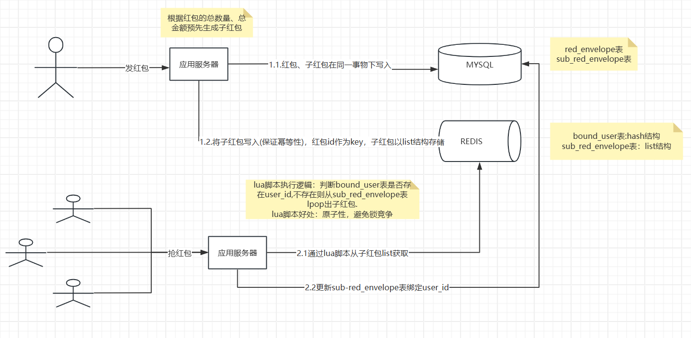

###  技术选型方案
     抢红包需求实现的技术难点在于高并发的环境下确保计算准确，传统数据库实现必须要加行级锁，导致性能急剧下降，达不到业务需求
     通过利用redis lua脚本的原子性避免了传统数据库实现锁竞争的问题。redis命令的单线程执行，以及lua脚本事务性特点，避开了锁竞争的问题。
     但由于数据的最终状态要落到数据库持久化，不可避免的出现了同一份数据在redis和数据库一致性的分布式事务问题，对于分布式事务的问题采用比较普遍的SAGA
     解决方案就可以。SAGA解决方案的主要特点是保证针对每一个数据源的操作的事务性、幂等性的前提下，在中间环节出现失败，通过补偿机制重试达到数据的最终一致性。

###  技术架构设计

